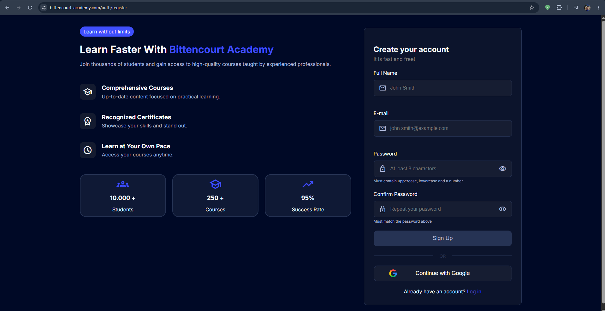
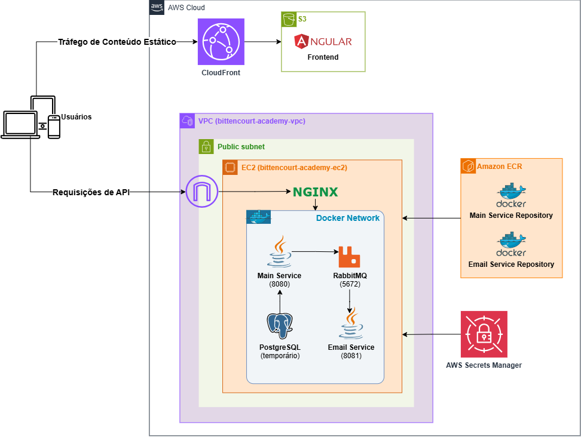

# Bittencourt Academy - Ainda em desenvolvimento
Uma simples plataforma de cursos inspirada na Udemy. Meu objetivo com este projeto não é apenas fortalecer meus conhecimentos em java, mas também aprender sobre toda a infraestrutura que existe por trás de um sistema e o fluxo que acontece para que o código que sai do computador do desenvolvedor chegue até o usuário final.

## Funcionalidades
> Este projeto ainda está em desenvolvimento. As funcionalidades abaixo estão divididas entre as que já foram implementadas e as que estão previstas.

### Autenticação
- Cadastro e login utilizando e-mail e senha
- Cadastro e login utilizando uma conta Google via OAuth2
- Autenticação baseada em JWT com access token e refresh token
- Verificação de e-mail via link

### Envio de E-mail
- Envio de e-mail de boas-vindas
- Envio de e-mail de verificação de e-mail

### Funcionalidades previstas
- Gerenciamento do curso
- Gerenciamento de módulos e aulas do curso
- Upload de videoaulas (.mp4)
- Entrega das videoaulas via HLS
- Fluxo de Matrícula
- Geração e validação de certificados

## Captura de Tela


## Arquitetura


## Tecnologias Utilizadas
### Backend
- Java 21
- Docker Compose
- Postgres
- RabbitMQ
- OAuth2
- JWT
- JUnit e Mockito
- Nginx

### Frontend
- Angular
- Typescript

### DevOps
- AWS:
    - EC2 (ubuntu)
    - ECR 
    - S3
    - CloudFront
    - Secrets Manager
    - Certificate Manager

## Estrutura do Projeto
```text
bittencourt-academy/
├── .github/
│   └── workflows/
│       ├── backend-deploy.yml
│       └── frontend-deploy.yml
├── backend/
│   ├── main-service/
│   ├── email-service/
│   └── rabbitmq/
├── frontend/
├── .env.example
├── docker-compose.local.yml
├── docker-compose.prod.yml
└── README.md
```
### Backend
- `main-service/` — API principal da plataforma.
- `email-service/` — Microserviço responsável pelo envio de e-mails.
- `rabbitmq/` — Configurações do RabbitMQ utilizado na comunicação assíncrona entre os serviços.

### Frontend
- `frontend/` — Aplicação web desenvolvida com Angular.

### Infraestrutura
- `docker-compose.local.yml` — Orquestração dos containers no ambiente de desenvolvimento.
- `docker-compose.prod.yml` — Orquestração dos containers no ambiente de produção.
- `.github/workflows/` — Workflows de CI/CD para backend e frontend.

## Backend CI/CD

O backend utiliza **GitHub Actions** para automatizar os testes, criação das imagens Docker e deploy na AWS.

O pipeline é executado em pushes para `main` que alterem o backend, o Docker Compose de produção ou o próprio workflow de deploy.

### Pipeline
1. **Testes** — Executa `mvn clean verify` no `main-service` e `email-service` usando Java 21.
2. **Build & Push** — Cria as imagens Docker dos dois serviços e envia para o **Amazon ECR**, utilizando o SHA do commit como tag.
3. **Deploy** — Conecta à instância **EC2**, envia as configurações de produção, autentica no ECR, recupera os secrets do **AWS Secrets Manager** e gera o `.env`.
4. **Atualização** — Baixa as novas imagens e recria os containers utilizando Docker Compose.
5. **Limpeza** — Remove imagens Docker não utilizadas da instância EC2.

### Serviços AWS
- **Amazon ECR** — Registro das imagens Docker
- **Amazon EC2** — Ambiente de produção
- **AWS Secrets Manager** — Armazenamento dos secrets de produ

## Frontend CI/CD

O frontend utiliza **GitHub Actions** para automatizar o build e deploy da aplicação Angular na AWS.

O pipeline é executado em pushes para `main` que alterem o frontend ou o próprio workflow de deploy.

### Pipeline
1. **Build** — Instala as dependências com `npm ci` e gera o build de produção do Angular.
2. **Artifact** — Salva o build gerado como um artifact do GitHub Actions.
3. **Deploy** — Baixa o artifact e envia os arquivos para um bucket **Amazon S3**.
4. **Cache** — Cria uma invalidação no **CloudFront** para disponibilizar imediatamente os novos arquivos.

### Serviços AWS
- **Amazon S3** — Hospedagem dos arquivos estáticos do frontend
- **Amazon CloudFront** — CDN e distribuição do frontend
- **AWS IAM + GitHub OIDC** — Autenticação segura com a AWS

## Execução Local
### Configuração de variáveis de ambiente
### Execução do backend
### Execução do frontend